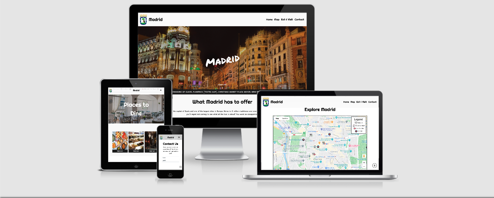
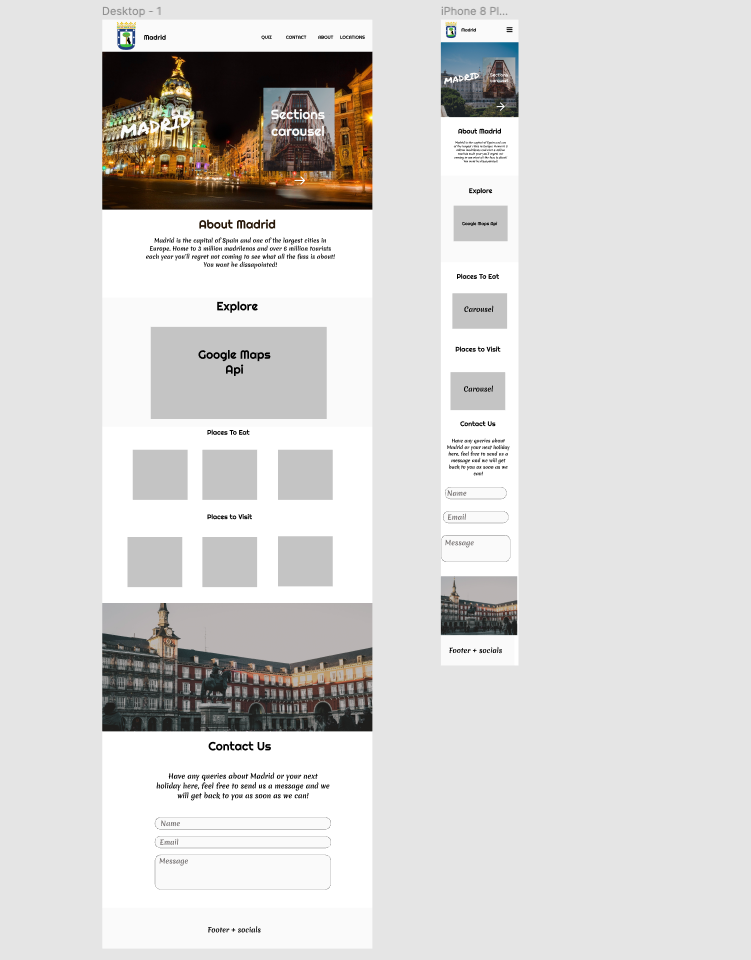

# Madrid Tourism: Milestone Project 2

[Live Project](https://ryanjbm.github.io/Milestone-Project-2/)

# Introduction

My Madrid website is a web page built to provide tourism information to users about the city of Madrid, informing them of places to visit, eat, event info, map showing locations of places via markers and a functional contact form allowing users to ask more questions about Madrid. My ideas for the page came from what I would like to see and know if i was to visit Madrid and some of the places have been recommended from my own personal experience in Madrid.

This is my second Milestone Project for my Full Stack Development Course at The Code Institute, in which I was given the instructions to make an Interactive Front End Project. In creating this website I used CSS3, HTML5 and JavaScript.

# UX

### Goals

* To make my Madrid Tourism website provide users with sufficient information about where they should eat and visit in Madrid
* To create an aesthetically pleasing and easy to navigate webpage for the user
* To use Interactive and effective features on my website
* Successful use of APIs in the webpage

### User Stories

1. I am a user looking for general tourism information about Madrid
1. I am a user looking for places to eat in Madrid
1. I am a user looking for directions to landmarks in Madrid
1. I am a user who wants to request other specific information about Madrid
1. I am a user wishing to find out information on events taking place in Madrid

### Design Process

1. I began my process by making a plan of how I wanted to layout my website. I came to the decision to do a single page website split into different sections including "Hero Section", "About Section", "Map Section", "Places to Eat & Visit" and a "Contact Form".
1. Throughout my design process I used a simple colour scheme and only a few fonts for my page, the colours I used were:  
  #fafafa (Background and some text) 
  Black (Most of text and button background) 
  Green (USed when hovering over menu items, card info and Map info window) 
  Orange  (Used for hovering and clicking buttons on page) 
After some experimentation and changes throughout the design and building process these were the colours that I decided look the best, the fonts I used were the following: 
  Righteous  
  Padauk  
  Permanent Marker  
1. I made a wireframe for my project using FIGMA. I made the design aesthetically pleasing and made sure it was easy to navigate through. I first made my desktop page and then made my mobile layout. Throughout the process of building my website I made a few changes and additions based off of my experience as well as input from family and friends
1. Some of the changes I made included adding images to seperate sections and a few colours and where they are used.

# [Figma Wireframe](https://www.figma.com)
> This includes the wireframes for both desktop and mobile device layouts

Throughout the process of coding my website and input from other people, a few improvements were made to the website to not only make it look more professional but also to include more useful features.
  
